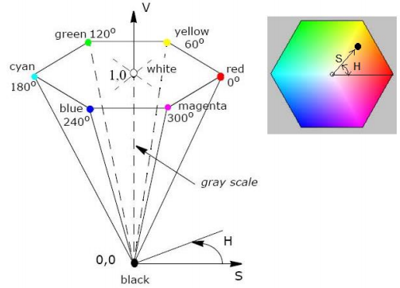
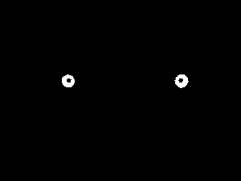
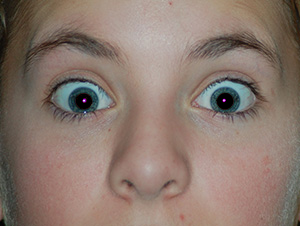

# Red-Eye Detection and Removal - Work in Progress
**Definition**  
The red-eye effect in photography is the common appearance of red pupils in color photographs of the eyes of humans and several other animals. In flash photography the light of the flash occurs too fast for the pupil to close, so much of the very bright light from the flash passes into the eye through the pupil, reflects off the fundus at the back of the eyeball and out through the pupil. The camera records this reflected light. The main cause of the red color is the ample amount of blood in the choroid which nourishes the back of the eye and is located behind the retina.

**Requirement**  
The purpose of this project is to implement a method of detecting and subsequently removing red-eye effects from digital images.  
The desired effect should look like this:

  

**Approach**  
The project will be implemented in C++ using the OpenCV library. 

The **first** is to detect and mask the color red of the original image  
This will be done by first converting the color space of our image from RGB to HSV. Since the Hue value encodes color color information, it will be the only value we need to achieve the effect. Thus, upon calculating the hue value, we will compare it to the values the red color takes. These values will be approximated by consulting the following image.

  

We can see that the pure red color has the hue value 0. We will take into account the variations of red as well and set the range to (340, 360) along with (0, 5).  
After doing this, the resulting image will look something like this.

  

We can see that the pupils were masked correctly but some parts of the image were masked as well. The **second** step is to isolate the pupils. We can do this by detecting the round objects, keeping them, and tossing the rest. If this is done correctly, the result will look like this.

  

The **last** step is take all the pixels that have their corresponding pixel in the masked image as white, and color them black. This should achieve the desired effect and would result in an image that looks like this.

  

