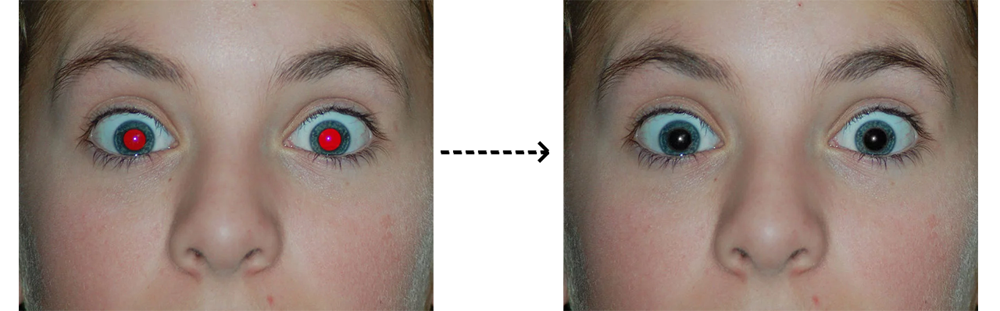

# Red-Eye Detection and Removal - Work in Progress

**Requirement**  
The purpose of this project is to implement a method of detecting and subsequently removing red-eye effects from digital images.  
The desired effect should look like this:

  

**Approach**  
The project will be implemented in C++ using the OpenCV library. 

The **first** step is to detect the eyes automatically.

  

The **second** step is to find the part of the pupil that is affected by the red eyes.  
To do this, loop over all the eyes we had detected in the previous step. Split the color image into its three channels and create a mask that is 1 for every pixel where the red channel is above a threshold and where the red channel is greater than the sum of green and blue channels.

  

Lastly, fix the red eye by making the red pixels in detected black.  

